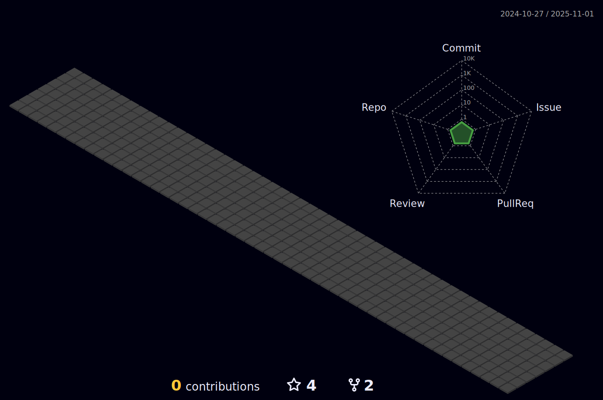

<h1 align="center"> Oi, eu sou o Gabriel Antunes!  </h1>
<h2 align="center"> Desenvolvedor Full-Stack </h2>

  

    Descobri com quase 30 anos um novo caminho que pode entregar toda realização profissional que eu sempre busquei.
    Sou extremamente apaxionado por solucionar problemas, tenho bom raciocínio lógico e busco através de projetos me desafiar cada vez mais e aplicar meus conhecimentos.
  Aqui neste repositório você encontra projetos que foram importantes na minha formação e que me orgulho pelo que agregaram na minha caminhada.
  

  
  <h2 align="center">Linguagens e tecnologias</h2>
   

  

   

 
   

  

  
  
 <h2 align="center">Redes sociais</h2>

 
  
  
  
   
 

   

